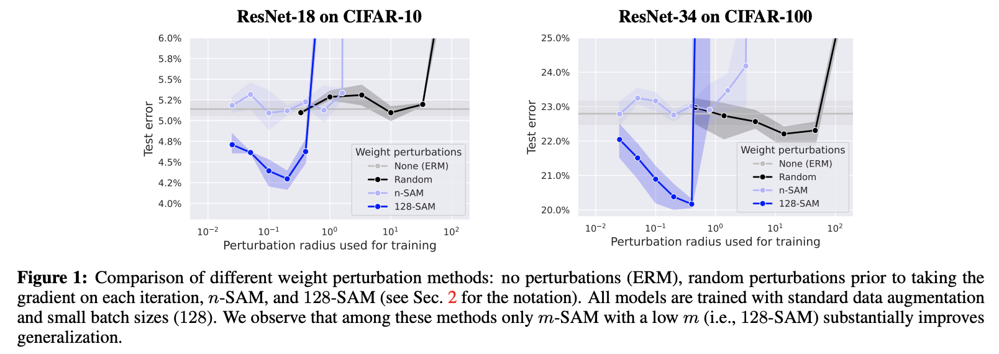
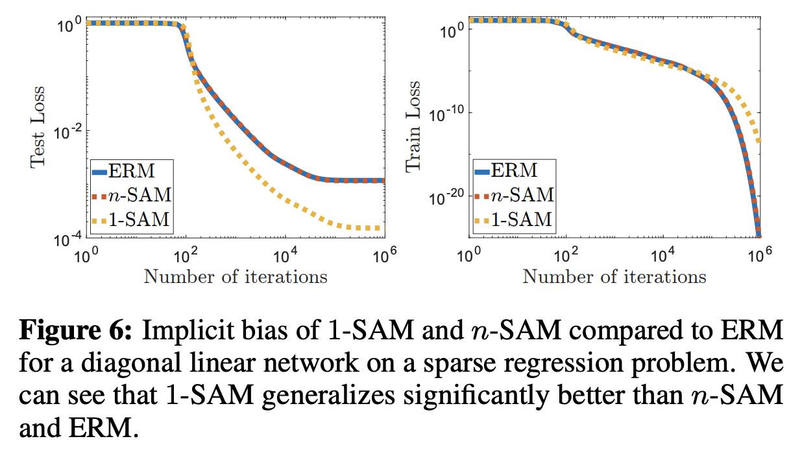
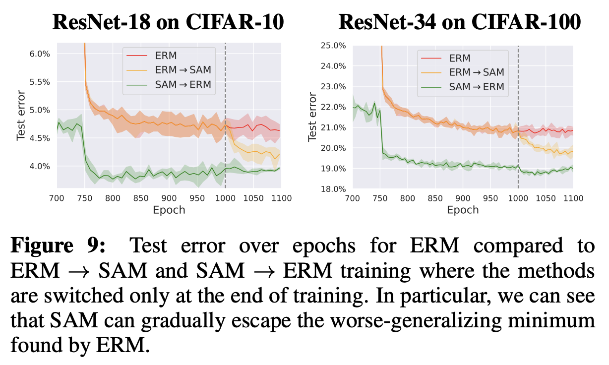
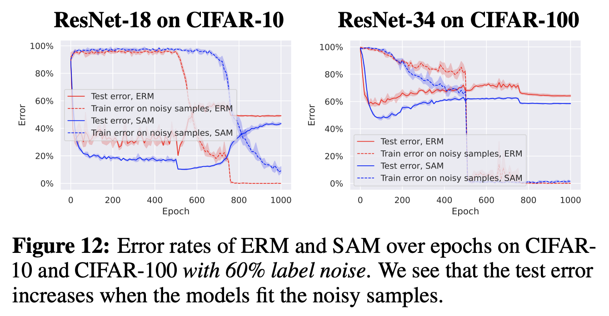

# Towards Understanding Sharpness-Aware Minimization 

**Maksym Andriushchenko (EPFL), Nicolas Flammarion (EPFL)**

**Paper:** [https://arxiv.org/abs/2206.06232](https://arxiv.org/abs/2206.06232)

**ICML 2022**

## Abstract
Sharpness-Aware Minimization (SAM) is a recent training method that relies on worst-case weight perturbations which significantly improves generalization in various settings. We argue that the existing justifications for the success of SAM which are based on a PAC-Bayes generalization bound and the idea of convergence to flat minima are incomplete. Moreover, there are no explanations for the success of using `m`-sharpness in SAM which has been shown as essential for generalization. To better understand this aspect of SAM, we theoretically analyze its implicit bias for diagonal linear networks. We prove that SAM always chooses a solution that enjoys better generalization properties than standard gradient descent for a certain class of problems, and this effect is amplified by using `m`-sharpness. We further study the properties of the implicit bias on non-linear networks empirically, where we show that fine-tuning a standard model with SAM can lead to significant generalization improvements. Finally, we provide convergence results of SAM for non-convex objectives when used with stochastic gradients. We illustrate these results empirically for deep networks and discuss their relation to the generalization behavior of SAM. 

## A few quick highlights
The number of examples over which we maximize (`m`) in `m`-SAM plays a key role:

We can explain the generalization improvement of 1-SAM (i.e., SAM with `m=1`) on a simple diagonal network:

We can finetune a standard model with SAM and get significant generalization improvement (which is also explained by the simple diagonal network):

`m`-SAM converges to a global minimum in practice (and to a critical point in theory, as we prove) and this can be harmful for the noisy label setting (although with early stopping, SAM is still better):

## Code
We performed experiments on three different model families:
- Folder `deep_nets`: code for training deep networks with `m`-SAM. Note that one can use `m` lower than the batch size via `--acc_steps` (implemented via gradient accumulation) and also SAM with multiple iterations via `--sam_iters`. A typical training command would look like this:
`python train.py --dataset=cifar10 --sam_rho=0.1  --sam_iters=1 --lr_max=0.1 --lr_schedule=piecewise --model=resnet18_gn --model_width=64 --epochs=200 --batch_size=128 --l2_reg=0.0005`

- Folder `diagonal_linear_nets`: code for training diagonal linear networks with 1-SAM and n-SAM.

- Folder `one_layer_relu_nets`: code for training one hidden layer ReLU networks with n-SAM.

## Dependencies
All the dependencies are collected in the `Dockerfile`.